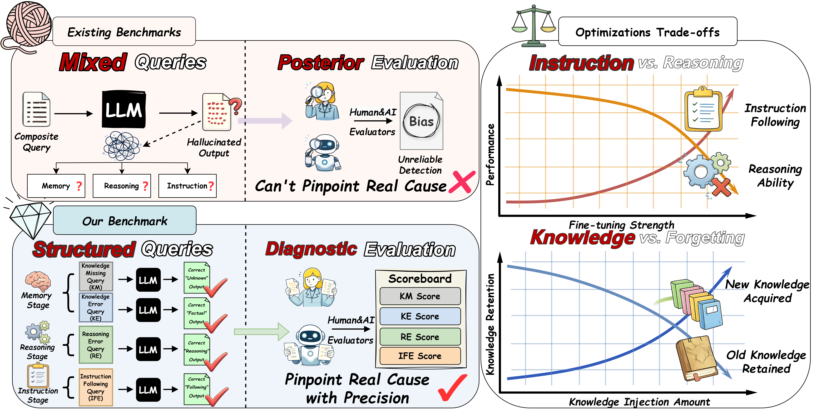
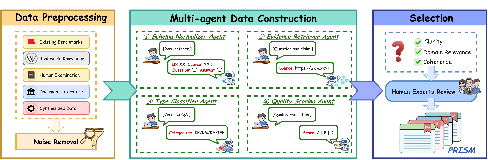
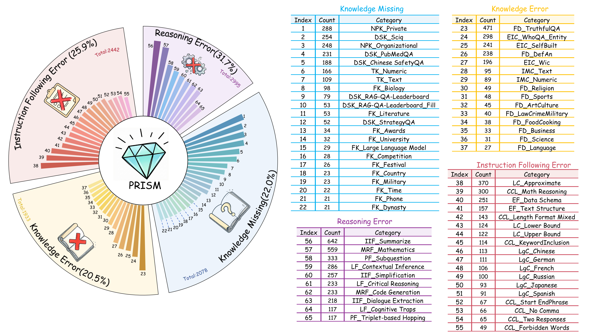

# PRISM: Probing Reasoning, Instruction, and Source Memory in LLM Hallucinations

<p align="center">
  
</p>

<p align="center">
  <b>Anonymous ACL 2025 Submission</b>
</p>

> **⚠️ Note: This repository currently provides a preview version with demo data and core code. The complete dataset (9,448 instances across 65 sub-tasks), full evaluation code, and all experimental results will be fully open-sourced upon paper acceptance. 待论文录用后，我们将全部开源所有数据、代码和实验结果。**

---

## Overview

**PRISM** is a controlled diagnostic benchmark that disentangles LLM hallucinations into four independent failure dimensions, grounded in three stages of the generation pipeline (memory retrieval, reasoning, and instruction following):

- **Knowledge Error (KE):** The model's parametric knowledge stores incorrect or outdated information.
- **Knowledge Missing (KM):** The model lacks the correct information required to answer the question.
- **Reasoning Error (RE):** The model possesses the necessary facts but fails to combine them through logic or reasoning.
- **Instruction Following Error (IFE):** The model possesses correct knowledge and reasoning capabilities, but its output violates explicit constraints provided by the user.

<p align="center">
  
</p>

<p align="center"><b>Figure 1:</b> Overview of the <i>PRISM</i> framework and optimization trade-offs. The left panel contrasts the mixed query design of existing benchmarks with our structured approach that isolates cognitive stages to pinpoint failure dimensions like KE, KM, RE, and IFE. The right panel illustrates performance trade-offs.</p>

---

## Benchmark Construction

PRISM follows a three-stage construction pipeline: **Data Collection → Multi-agent Data Construction → Human Selection**.

<p align="center">
  
</p>

<p align="center"><b>Figure 2:</b> The three-phase pipeline of <i>PRISM</i> benchmark construction.</p>

### Data Statistics

**PRISM** contains **9,448** evaluation instances covering **4 failure dimensions** and **65 sub-tasks**:

| Dimension | Samples | Percentage |
|:---------:|:-------:|:----------:|
| Reasoning Error (RE) | 2,995 | 31.7% |
| Instruction Following Error (IFE) | 2,442 | 25.9% |
| Knowledge Missing (KM) | 2,078 | 22.0% |
| Knowledge Error (KE) | 1,933 | 20.5% |

<p align="center">
  
</p>

<p align="center"><b>Figure 3:</b> The hierarchical distribution of <i>PRISM</i>. The inner circle represents the four primary failure dimensions, while the outer ring details 65 sub-tasks.</p>

---

## Main Results

We evaluated **24 mainstream LLMs** (both proprietary and open-source) across all four hallucination dimensions. All values are hallucination rates ℋ (%) — **lower is better**.

| Type | Model | Size | Think | KE | KM | RE | IFE | ℋ-Score |
|:-----|:------|:----:|:-----:|:---:|:---:|:---:|:----:|:-------:|
| *Proprietary* | GPT-5.2 | - | ✅ | 17.83% | **5.57%** | 24.67% | 15.35% | 15.85% |
| | GPT-5.1 | - | ✅ | 25.83% | 11.46% | 26.01% | 25.62% | 22.23% |
| | GPT-4o-20241120 | - | ❌ | 19.36% | 8.90% | 29.72% | 16.78% | 18.69% |
| | Gemini-3-Pro | - | ✅ | **16.31%** | 12.80% | **17.19%** | **10.85%** | **14.29%** |
| | Gemini-3-Flash | - | ✅ | 16.48% | 8.12% | 21.59% | 16.00% | 15.55% |
| | Claude-Opus-4.5 | - | ✅ | **13.80%** | **6.35%** | 19.68% | 15.77% | **13.90%** |
| | Claude-Sonnet-4.5 | - | ✅ | 16.11% | 7.03% | 23.53% | 16.87% | 15.89% |
| | Grok-4.1 | - | ❌ | 19.20% | 17.03% | 34.94% | 20.04% | 22.80% |
| *Open-source* | DeepSeek-V3.2 | 685B | ❌ | 17.99% | 7.94% | 28.31% | 14.31% | 17.14% |
| | DeepSeek-R1 | 671B | ✅ | 18.87% | 10.13% | 28.04% | **11.97%** | 17.25% |
| | Qwen3-235B | 235B | ✅ | **17.37%** | **7.00%** | **25.89%** | 17.87% | **17.03%** |
| | GLM-4.5 | 355B | ✅ | 18.85% | 10.70% | 29.34% | 15.06% | 18.49% |
| | Llama-3.3-70B-Instruct | 70B | ❌ | 19.75% | **6.24%** | 29.47% | 13.13% | 17.15% |
| | Llama-3.1-8B-Instruct | 8B | ❌ | 25.53% | 14.04% | 54.50% | 23.36% | 29.36% |

<p align="center"><b>Table 2:</b> Main Results on Hallucination Rates. Models are highlighted with <b>Best</b> within each group.</p>

---

## Repository Structure

```
Anonymous_PRISM/
├── README.md
├── figures/
│   ├── overview.png              # Figure 1: Framework overview
│   ├── pipeline-1.png            # Figure 2: Construction pipeline
│   ├── data_distribution-1.png   # Figure 3: Data distribution
│   └── prism_logo.jpg            # PRISM logo
├── data/
│   ├── KE/
│   │   └── KE_demo.json          # Knowledge Error demo (3 samples)
│   ├── KM/
│   │   └── KM_demo.json          # Knowledge Missing demo (3 samples)
│   ├── RE/
│   │   └── RE_demo.json          # Reasoning Error demo (3 samples)
│   └── IFE/
│       └── IFE_demo.json         # Instruction Following Error demo (3 samples)
└── code/
    ├── inference_open.py          # Inference script for open-source models (vLLM)
    ├── inference_api.py           # Inference script for proprietary API models
    └── evaluate.py                # LLM-as-judge evaluation script
```

> **Note:** The `data/` directory currently contains **demo samples only** (3 per dimension). The full dataset with all 9,448 instances will be released upon acceptance.

---

## Quick Start

### Requirements

```bash
pip install vllm torch openai tqdm
```

### Inference (Open-Source Models)

```bash
python code/inference_open.py \
    --data-dir ./data \
    --output-dir ./results \
    --gpus 4 \
    --model-type qwen
```

### Inference (API Models)

```bash
python code/inference_api.py \
    --config your_model_config.json \
    --data-dir ./data \
    --output-dir ./results/api
```

### Evaluation

```bash
python code/evaluate.py \
    --data-dir ./results \
    --output-dir ./evaluated \
    --judge-model meta-llama/Llama-3-8B-Instruct \
    --model-type llama \
    --gpus 4
```

---

## Data Format

Each data sample follows this JSON schema:

```json
{
  "ID": 1,
  "question": "The evaluation question text...",
  "answer": "The ground-truth answer",
  "metric": "evaluation_metric_type",
  "category": "sub_task_category"
}
```

---

## Full Release Plan

**🔜 The following resources will be fully released upon paper acceptance:**

- **Complete Dataset:** All 9,448 evaluation instances across 4 dimensions and 65 sub-tasks
- **Full Evaluation Suite:** Complete evaluation scripts with all metric implementations
- **Model Results:** Raw outputs from all 24 evaluated models
- **Analysis Tools:** Scripts for reproducing all tables and figures in the paper

---

## Citation

```bibtex
@inproceedings{anonymous2025prism,
  title={PRISM: Probing Reasoning, Instruction, and Source Memory in LLM Hallucinations},
  author={Anonymous},
  booktitle={ACL 2025 (Under Review)},
  year={2025}
}
```

---

## License

This project is released under the [MIT License](LICENSE).
